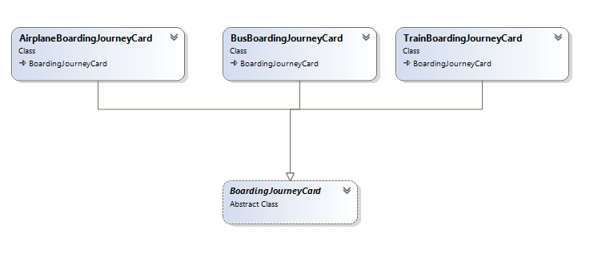
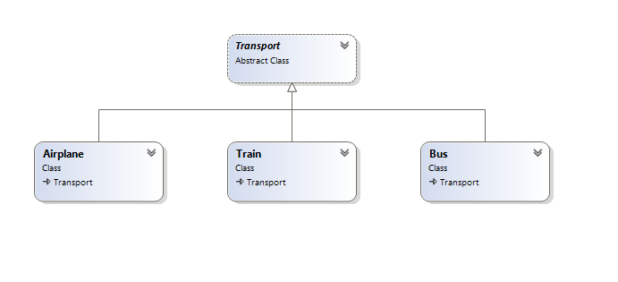
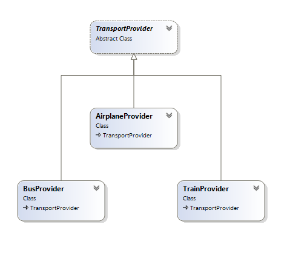
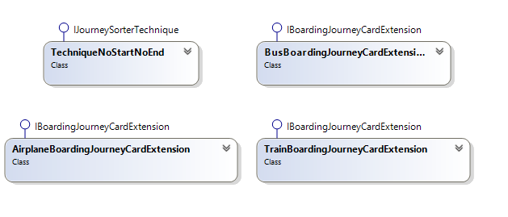
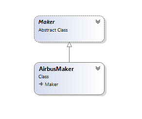
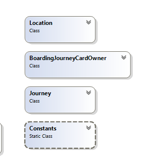
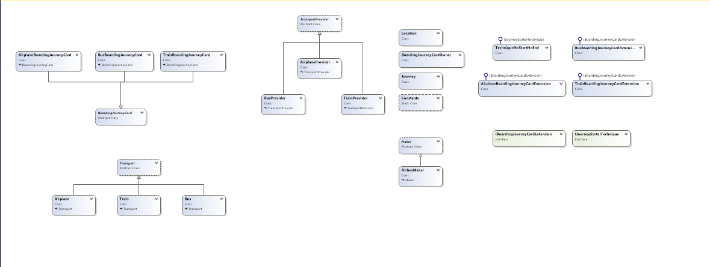

# .Net C# Trip-Sorter

First C#.Net Trip-Sorter on GitHub


## Features
Soultion with 4 projects:
* .Net Assembly dll
* Test Console Application
* Web-API Azure Mobile Service
* Web-site ASP.Net for client users test the API


## Supported
* iOS
* macOS
* Android
* Universal Windows Platform (Win10/UWP)
* Chrome App/Extention
* Any app can call the API


### Live web-API Demo


[Trip-Sorter -Azure Mobile Service](http://tripsorterapi-001-site1.itempurl.com/)


### Live Web-Site for client Test:


[Web-App](http://tripsorter-001-site1.dtempurl.com)

### Installation:

```csharp
1- Dawnload Git-repository files
2- open 'Executable File' zip folder
3- Run TripSorterTest.exe console application
```

### Open the souce code:

```csharp
1- Dawnload Git-solution files
2- Extract the zip file
3- open on VS 2017
4- Run from Debug>>Start Debugging F5 or Start Without Debugging Ctrl+F5
```

### Class Diagram & Desgin Pattern

1- Bourding Journey Card


2- Transportations


3- Transport Company Provider


4- Extentions classes


5- Interfaces


6- Marker base and child class


7- Normal classes with-out relationships


8- Full diagram

you can see also [ClassDiagramTripSorterAssembly.cd](https://github.com/MostafaMonib/TripSorter/blob/master/TripSorter/ClassDiagramTripSorterAssembly.cd) file with good quailty


### FAQ
* For Any question feel free to contact me @ mostafa.monib@gmail.com


Regards, 
Developer By: Mostafa Monib
